# AIMA — Complete Platform Guide
### AI for Marketing Analytics | How It Works, What It Does, Why It Matters

---

## Table of Contents

1. [What Is AIMA?](#1-what-is-aima)
2. [The Big Picture — System Architecture](#2-the-big-picture--system-architecture)
3. [How Data Flows Through the Platform](#3-how-data-flows-through-the-platform)
4. [The 12 Services Running Under the Hood](#4-the-12-services-running-under-the-hood)
5. [Connecting Your Data Sources](#5-connecting-your-data-sources)
6. [The 7 AI Modules — What Each One Does](#6-the-7-ai-modules--what-each-one-does)
   - [Module 1 — Customer Intelligence Engine](#module-1--customer-intelligence-engine)
   - [Module 2 — Campaign Performance Predictor](#module-2--campaign-performance-predictor)
   - [Module 3 — Content Studio](#module-3--content-studio)
   - [Module 4 — Brand Intelligence Monitor](#module-4--brand-intelligence-monitor)
   - [Module 5 — Marketing Attribution Engine](#module-5--marketing-attribution-engine)
   - [Module 6 — CLV & Churn Intelligence](#module-6--clv--churn-intelligence)
   - [Module 7 — Autonomous AI Marketing Agent](#module-7--autonomous-ai-marketing-agent)
7. [Every Page in the Frontend](#7-every-page-in-the-frontend)
8. [Every API Endpoint](#8-every-api-endpoint)
9. [Background Jobs — What Runs Automatically](#9-background-jobs--what-runs-automatically)
10. [The Database — What Gets Stored and Why](#10-the-database--what-gets-stored-and-why)
11. [Who Is This For and Why Is It Useful?](#11-who-is-this-for-and-why-is-it-useful)
12. [Tech Stack Summary](#12-tech-stack-summary)

---

## 1. What Is AIMA?

AIMA is an **open-source, self-hosted AI marketing intelligence platform**. It replaces a collection of expensive, fragmented SaaS tools — things like Klaviyo, Segment, Sprout Social, Northbeam, and custom attribution software — with a single unified system that runs on your own infrastructure.

**The core problem it solves:** Marketing teams make expensive decisions with incomplete information because their customer data lives in 10 different tools that never talk to each other. Nobody has the full picture. AIMA pulls everything into one place, runs 7 deep learning models over it continuously, and surfaces clear, actionable intelligence.

**What makes it different from a dashboard tool:** It does not just display data. It *understands* your customers using AI, *predicts* what will happen before it happens, *generates* content and strategies, and can *execute* campaigns autonomously through an AI agent.

**Who pays for this problem today:** Mid-market and enterprise marketing teams spend $30,000–$200,000 per year on combinations of:
- Segmentation tools (Segment, mParticle)
- Attribution tools (Northbeam, Triple Whale, Rockerbox)
- Customer intelligence (Klaviyo AI, Salesforce Einstein)
- Sentiment monitoring (Brandwatch, Sprout Social)
- Content generation (Jasper, Copy.ai)
- Churn prediction (ChurnZero, Gainsight)

AIMA provides all of it, open-source, on your own infrastructure.

---

## 2. The Big Picture — System Architecture


---

## 3. How Data Flows Through the Platform


**In plain English:**
1. Every 30 minutes, AIMA pulls fresh customer, order, and event data from all connected platforms
2. Every 6 hours, it recomputes 45+ behavioural features for every customer (recency, frequency, spend, engagement rates, preferred times, loyalty score, etc.)
3. Once a day at 2am, it runs the churn model against every customer and updates their risk score
4. Once a day at 6am, it checks if customers have drifted between segments
5. Every 15 minutes, it pulls new brand mentions and scores their sentiment across 10 dimensions
6. Any time you request a campaign prediction, content generation, or attribution report, it computes on demand
7. All results are written back to the database and served through the API to the frontend

---

## 4. The 12 Services Running Under the Hood

When you run `docker compose up`, 12 services start automatically. You never need to interact with most of them directly.

```mermaid
graph TD
    subgraph "User-facing"
        S1[🌐 Frontend\nNext.js :3000]
        S2[⚡ API\nFastAPI :8000]
    end

    subgraph "Data & Storage"
        S3[(🐘 PostgreSQL :5432\nMain database)]
        S4[(⚡ Redis :6379\nCache + queue)]
        S5[(🗂 MinIO :9000\nFile storage)]
    end

    subgraph "Background Processing"
        S6[👷 Celery Worker\nRuns AI tasks]
        S7[⏱ Celery Scheduler\nTriggers jobs on schedule]
    end

    subgraph "Event Streaming"
        S8[📨 Kafka :9092\nEvent stream]
        S9[🦓 Zookeeper :2181\nKafka coordinator]
    end

    subgraph "ML Platform"
        S10[🧪 MLflow :5001\nExperiment tracker]
    end

    subgraph "Monitoring"
        S11[📊 Grafana :3001\nDashboards]
        S12[📈 Prometheus :9090\nMetrics collector]
    end

    S1 <-->|HTTP requests| S2
    S2 <-->|Read/write| S3
    S2 <-->|Cache| S4
    S2 <-->|Job queue| S4
    S6 <-->|Jobs| S4
    S6 <-->|Model files| S5
    S6 <-->|Results| S3
    S7 -->|Triggers| S6
    S8 -->|Events| S3
    S9 -->|Coordinates| S8
    S6 -->|Logs experiments| S10
    S12 -->|Feeds| S11
    S2 -->|Exposes metrics| S12
```



| Service | Port | What a non-technical person sees |
|---|---|---|
| **Frontend** | 3000 | The main dashboard you use every day |
| **API** | 8000 | Powers the dashboard (also has Swagger docs at `/docs`) |
| **PostgreSQL** | 5432 | Where all your customer and campaign data lives |
| **Redis** | 6379 | Makes the platform fast (invisible to you) |
| **MinIO** | 9001 | File storage console — trained models, exports |
| **Celery Worker** | — | Runs AI tasks in the background (invisible to you) |
| **Celery Scheduler** | — | Triggers scheduled jobs (invisible to you) |
| **Kafka** | 9092 | Handles high-speed event streams (invisible to you) |
| **Zookeeper** | 2181 | Keeps Kafka running reliably (invisible to you) |
| **MLflow** | 5001 | Tracks AI model training runs and experiments |
| **Grafana** | 3001 | Server health and performance monitoring dashboards |
| **Prometheus** | 9090 | Collects metrics from all services (feeds Grafana) |

---

## 5. Connecting Your Data Sources


**Currently supported connectors:**

| Platform | What AIMA pulls |
|---|---|
| **Shopify** | Customers, all orders, order items, shipping addresses |
| **Klaviyo** | Email profiles, open events, click events, unsubscribes, bounces |
| **HubSpot** | Contacts, deals, lifecycle stages, company associations |
| **Meta Ads** | Campaign spend, impressions, clicks, conversions, ROAS by campaign |
| **Google Analytics 4** | Sessions, conversions, page performance, engagement, traffic sources |

**Planned connectors:** WooCommerce, Magento, Salesforce, Mailchimp, ActiveCampaign, Google Ads, TikTok Ads, LinkedIn Ads, Mixpanel, Amplitude, Twitter/X, Instagram, Reddit, Trustpilot, G2, App Store, Google Play

---

## 6. The 7 AI Modules — What Each One Does

---

### Module 1 — Customer Intelligence Engine

**What it solves:** Standard CRM tools segment customers by simple rules ("bought in last 30 days" or "spent over £100"). This misses the real complexity of behaviour. Two customers with the same lifetime value can have completely different patterns — one buys frequently in small amounts, one buys rarely in large amounts. They need different treatment.

**What AIMA does instead:** Uses a Temporal Behavioral Transformer (deep learning model) to read each customer's entire history as a *sequence*, like reading a story. Then groups customers by natural behaviour patterns using unsupervised clustering (UMAP + HDBSCAN), finding segments the algorithm discovers rather than humans define.


**What you see:** On the Segments page, a pie chart of your customer distribution across segments, each with its health score (0–100), average lifetime value, and the AI's recommended strategy for that group. A drift badge shows if a segment is growing, shrinking, or showing early warning signs.

**Output fields per customer:**
- `recency_days` — days since last purchase
- `frequency` — purchase count in last 12 months
- `monetary_value` — total spend
- `avg_order_value`
- `email_open_rate`, `email_click_rate`
- `cart_abandonment_rate`
- `website_visit_frequency`
- `preferred_day_of_week`, `preferred_hour_of_day`
- `price_sensitivity_score`
- `brand_loyalty_score`
- `customer_health_score` (0–100 composite)
- `behavioral_vector` (128-dimensional embedding)

---

### Module 2 — Campaign Performance Predictor

**What it solves:** You write a campaign, you send it to 50,000 people, and a week later you find out it underperformed. You wasted budget and opportunity. There was no way to know in advance.

**What AIMA does:** Before you launch, it predicts the outcome. Give it your subject line, target segment, channel, offer, and budget — it tells you the expected open rate, click rate, conversion rate, and revenue. If the forecast looks weak, you adjust before spending a penny.

```mermaid
flowchart LR
    A[Campaign inputs\nSubject line\nContent\nTarget segment\nChannel\nSend time\nOffer type\nBudget] --> B[Campaign DNA\nEncoder\nMulti-modal model\ntext + structured features]

    B --> C[Multi-task\nPerformance Predictor\nOne model,\n5 outputs simultaneously]

    C --> D[📬 Predicted\nOpen Rate]
    C --> E[👆 Predicted\nClick Rate]
    C --> F[💰 Predicted\nConversion Rate]
    C --> G[💵 Predicted\nRevenue]
    C --> H[📈 Predicted\nROI]

    D & E & F & G & H --> I{Is predicted\nperformance good?}

    I -->|Yes → Launch| J[Campaign runs\nActual results tracked]
    I -->|No → Optimise| K[Campaign Optimizer\nRecommends changes:\nbetter subject line,\ndifferent send time,\nadjusted offer]
    K --> A

    J --> L[Causal Lift Estimator\nSeparates campaign effect\nfrom organic behaviour\nwould they have bought anyway?]
    L --> M[True campaign ROI\nstored in database]
```



**What you see:** On the Campaigns page, a table showing predicted vs. actual results for every campaign. The delta column shows whether each campaign beat or missed its forecast. Over time, as the model learns from your campaigns, predictions become more accurate.

---

### Module 3 — Content Studio

**What it solves:** Writing marketing copy is slow, inconsistent, and doesn't use performance data. Most content is written based on gut feeling, not what actually converts.

**What AIMA does:** Generates brand-aligned, conversion-optimised content by learning your brand voice from your existing content, then fine-tuning output based on what has historically converted for your specific audience.

```mermaid
flowchart TD
    A[You select:\nChannel email/sms/ad\nTarget segment\nTone\nGoal] --> B[Brand Voice Encoder\nHas learned your\nbrand's personality,\nterminology, style\nfrom past content]

    B --> C[Outcome-supervised LLM\nFine-tuned on conversion\ndata — not human\nratings]

    C --> D[Personalization Engine\nAdjusts tone and messaging\nfor target segment\nChampions get VIP tone\nAt-Risk get urgency tone]

    D --> E{Channel}

    E -->|Email| F[📧 Email Package\nSubject line variants x5\nPreview text\nFull body copy\nCTA button text\nFull HTML template]

    E -->|SMS| G[📱 SMS Message\n160 characters max\nOptimised for\nmobile conversion]

    E -->|Meta Ads| H[📣 Ad Copy\nPrimary text\nHeadline\nDescription\nImage prompt\nAudience suggestion]

    E -->|Google Ads| I[🔍 Search Ad\nHeadline 1/2/3\nDescription 1/2\nDisplay URL\nExtensions]

    F & G & H & I --> J[Content Performance\nPredictor\nScores each variant\nby predicted\nconversion rate]

    J --> K[Ranked variants\nshown to you\nbest first]
```



**What you see:** A form where you pick channel, segment, and tone. After clicking Generate, you see multiple variants ranked by predicted performance. For email, you can toggle between text preview and full HTML preview. The highest-ranked subject line is highlighted. You copy the content directly into your email platform.

---

### Module 4 — Brand Intelligence Monitor

**What it solves:** Brand reputation problems are invisible until they're crises. By the time you see a surge in 1-star reviews, the damage is already spreading. Marketing teams also don't know which specific aspect of their brand — product quality? shipping? customer service? — is driving sentiment.

**What AIMA does:** Monitors all major platforms every 15 minutes, scores every mention across 10 specific brand dimensions using a specialised NLP model (DeBERTa), and fires alerts before problems escalate.

```mermaid
flowchart TD
    A[Brand mentions collected\nevery 15 minutes from:\nTwitter/X\nInstagram\nFacebook\nTikTok\nYouTube\nReddit\nGoogle Reviews\nTrustpilot\nG2\nAmazon] --> B[DeBERTa ABSA Model\nAspect-Based\nSentiment Analysis]

    B --> C[Scores each mention\nacross 10 dimensions\n0-100 per dimension]

    C --> D1[🏭 Product Quality]
    C --> D2[🎧 Customer Service]
    C --> D3[💰 Pricing & Value]
    C --> D4[🤝 Brand Trust]
    C --> D5[🚀 Innovation]
    C --> D6[🌱 Sustainability]
    C --> D7[🖥 User Experience]
    C --> D8[🚚 Delivery & Logistics]
    C --> D9[✨ Brand Personality]
    C --> D10[🏆 Competitive Position]

    D1 & D2 & D3 & D4 & D5 & D6 & D7 & D8 & D9 & D10 --> E[Trend & Anomaly\nDetector]

    E -->|Normal| F[Update radar chart\nin dashboard]
    E -->|Spike detected| G{Severity?}

    G -->|Gradual decline| H[⚠️ Medium Alert\nDimension weakening]
    G -->|Sudden drop| I[🔴 High Alert\nPotential PR issue]
    G -->|Viral negative| J[🚨 Critical Alert\nCrisis detected\nAct immediately]

    F & H & I & J --> K[Stored in alerts table\nDisplayed on\nBrand Monitor page]
```



**What you see:** A radar chart with 10 spokes — each showing your score on that brand dimension. A trend area chart shows overall sentiment over 30 days. Below that, a live mentions feed shows actual posts tagged with which dimension they relate to and whether they're positive, negative, or neutral. The Alerts section in the sidebar lights up when something needs your attention.

---

### Module 5 — Marketing Attribution Engine

**What it solves:** Last-click attribution — where the final channel a customer touched before buying gets 100% of the credit — is the industry's most expensive lie. It causes companies to over-invest in branded search (which captures demand) and massively under-invest in social and display (which creates demand). Budgets are misallocated by millions.

**What AIMA does:** Uses a Neural Marketing Mix Model that accounts for the full funnel: the residual effect of ads over time (adstock), the diminishing returns of increasing spend on a channel (saturation), and the synergies between channels.


**What you see:** A horizontal bar chart showing what percentage of your revenue each channel truly drove. An ROI bar chart — green bars are profitable, red bars are money-losing. A budget reallocation recommendation with a specific projected revenue increase. A detailed table showing adstock and saturation parameters for each channel (how long ads stay in memory, where returns start diminishing).

---

### Module 6 — CLV & Churn Intelligence

**What it solves:** Most companies find out a customer churned after it's too late. The window to intervene — before they mentally checked out — is usually 2–8 weeks before they actually stop buying. The right intervention (a win-back offer, a loyalty reward, a personalised discount) during that window can prevent churn that costs thousands in lifetime value. But you need to know *who* to target and *what* to offer.

**What AIMA does:** Runs a survival analysis model (DeepHit) that gives a full probability curve per customer — "there is a 23% chance this customer churns in 30 days, 51% in 60 days, 78% in 90 days." It also computes each customer's predicted lifetime value so you can prioritise interventions by financial impact. Then a causal intervention model recommends the specific action with the highest probability of retaining *this specific customer*, based on what worked for similar customers in the past.

```mermaid
flowchart TD
    A[Customer's full\nbehavioural history\nfrom feature table] --> B[DeepHit Survival\nAnalysis Model\nOutput: survival curve\nper customer]

    B --> C[30-day churn prob\ne.g. 23%]
    B --> D[60-day churn prob\ne.g. 51%]
    B --> E[90-day churn prob\ne.g. 78%]

    C & D & E --> F{Risk Level}
    F -->|Prob > 70%| G[🔴 HIGH RISK]
    F -->|Prob 40-70%| H[🟡 MEDIUM RISK]
    F -->|Prob < 40%| I[🟢 LOW RISK]

    A --> J[Probabilistic CLV\nBG/NBD + Deep Learning\nWhat is this customer\nworth over their lifetime?]

    G & H --> K[Causal Intervention\nRecommender\nCausal forests:\nwhat intervention works\nbest for THIS customer?]

    K --> L[Win-back email\nwith 15% discount]
    K --> M[Loyalty reward\n2x points this week]
    K --> N[Personalised product\nrecommendation]
    K --> O[Exclusive early\naccess offer]
    K --> P[Reengagement\ncampaign sequence]

    J --> Q[Priority score\nHigh CLV + High risk\n= top priority for\nintervention spend]

    L & M & N & O & P & Q --> R[Shown in CLV & Churn\ndashboard table]
```



**What you see:** A risk distribution pie chart. A customer survival curve showing what percentage of customers remain at each time point. A full table listing every customer's 30/60/90-day churn probability, their predicted lifetime value, their risk badge, and a specific recommended intervention. An "At-Risk Segments" section showing which whole groups are deteriorating. You can click to trigger a campaign targeting any at-risk segment immediately.

---

### Module 7 — Autonomous AI Marketing Agent

**What it solves:** Even with all the above data and insights, someone has to sit there, interpret it, decide what to do, plan the campaign, write the content, and execute. That's still hours of work per week. What if you could just describe your goal and the AI does the rest?

**What AIMA does:** A multi-agent orchestration system built on LangGraph. Six specialised AI sub-agents work together behind a single chat interface. You describe a goal. The agents plan, research your live data, generate content, estimate performance, and can queue campaigns for execution.

```mermaid
flowchart TD
    A([You type:\n"My at-risk segment grew 20%\nthis month. Plan a\nre-engagement campaign."])

    A --> B[🧠 Planner Agent\nBreaks goal into\nstructured plan:\n1. Assess at-risk segment\n2. Identify sub-groups\n3. Design interventions\n4. Generate content\n5. Predict performance\n6. Queue for launch]

    B --> C[🔍 Research Agent\nReads your LIVE data:\n- Current segment sizes\n- Health scores\n- Recent sentiment\n- Past campaign results]

    C --> D[✍️ Content Agent\nGenerates all\ncampaign materials:\n- Subject lines\n- Email body\n- SMS fallback\n- Ad variants]

    D --> E[📊 Analytics Agent\nMonitors live campaign\nperformance vs predictions\nin real time]

    E --> F[⚙️ Optimizer Agent\nPauses underperformers\nShifts budget\nRuns A/B tests]

    F --> G[📋 Reporting Agent\nGenerates weekly report\nin plain English:\nwhat worked, what didn't,\nwhat to do next month]

    B & C & D & E & F & G --> H([You see:\nStructured plan\nContent previews\nPredicted performance\nAction buttons\nAll in chat interface])
```

**What you see:** A chat interface. You type in plain English. The AI responds with a structured plan, shows content previews, displays predicted performance numbers, and gives you action buttons to approve or modify each step. On the right sidebar: a list of all marketing capabilities the agent can access. Below that: your plan history. You can come back to any previous plan, see what the agent recommended, and track how it performed.

---

## 7. Every Page in the Frontend

### Home — Dashboard (`/`)


### Customers Page (`/customers`)
Searchable, filterable table of every customer. Health score colour badges (🔴 at-risk, 🟡 needs attention, 🟢 healthy). Click any customer to see their full 45-metric behavioural profile.

### Segments Page (`/segments`)
Pie chart (segment size distribution) + bar chart (health and LTV comparison). Segment table with drift status, recommended strategy, and a Re-Segment button.

### Campaigns Page (`/campaigns`)
Predicted vs. actual revenue line chart. Predicted vs. actual open rates bar chart. Full campaign table with channel badges, status, and delta indicators. Create Campaign button.

### Content Studio (`/content-studio`)
Channel selector → Segment selector → Tone selector → Generate button → Multiple content variants ranked by predicted conversion rate. Email shows both text and HTML preview tabs.

### Brand Monitor (`/brand-monitor`)
10-dimension radar chart. 30-day sentiment trend area chart. Donut gauges per dimension with trend arrows. Live mentions feed with sentiment labels and source icons.

### Attribution (`/attribution`)
Channel contribution horizontal bar chart. ROI bar chart (green = profitable, red = loss). Budget optimizer panel with recommended reallocation and projected uplift. Detailed attribution parameters table.

### CLV & Churn (`/clv-churn`)
Risk distribution pie chart. Intervention recommendations bar chart. Customer survival curve area chart. At-risk segments table. Full predictions table with all churn probabilities, CLV, and recommended interventions.

### AI Agent (`/agent`)
Full chat interface with typing indicators. Starter prompt chips. Structured plan cards with action buttons. Marketing capabilities sidebar. Plan history panel.

---

## 8. Every API Endpoint

All endpoints are available with interactive documentation at `http://localhost:8000/docs`.

### Health
| Method | Path | What it returns |
|---|---|---|
| GET | `/health` | `{"status": "ok", "version": "0.1.0"}` — used by healthchecks |
| GET | `/health/detailed` | Database + Redis status check |

### Connectors (`/api/v1/connectors`)
| Method | Path | What it does |
|---|---|---|
| GET | `/connectors` | Lists all active data source connections |
| POST | `/connectors` | Creates a new connector (Shopify, Klaviyo, etc.) |
| DELETE | `/connectors/{id}` | Disables a connector |

### Customers (`/api/v1/customers`)
| Method | Path | What it returns |
|---|---|---|
| GET | `/customers` | Paginated list, searchable, filterable by health score |
| GET | `/customers/{id}` | Full customer profile |
| GET | `/customers/{id}/features` | All 45 computed behavioural features |

### Segments (`/api/v1/segments`)
| Method | Path | What it returns |
|---|---|---|
| GET | `/segments` | All segments with health, LTV, drift status |
| GET | `/segments/{id}` | Segment details with characteristics and strategy |
| GET | `/segments/{id}/members` | Customers in this segment with confidence scores |
| POST | `/segments` | Create manual segment |
| POST | `/segments/{id}/activate` | Re-activate an archived segment |
| POST | `/segments/run-segmentation` | Trigger full AI re-segmentation |

### Campaigns (`/api/v1/campaigns`)
| Method | Path | What it returns |
|---|---|---|
| GET | `/campaigns` | All campaigns with predicted vs. actual performance |
| GET | `/campaigns/{id}` | Full campaign detail with performance deltas |
| POST | `/campaigns` | Create new campaign draft |
| GET | `/campaigns/analytics/summary` | Aggregate performance: open rate, CTR, revenue by channel |

### Content Studio (`/api/v1/content`)
| Method | Path | What it does |
|---|---|---|
| POST | `/content/generate/email` | Generates subject lines, body, CTA, full HTML |
| POST | `/content/generate/sms` | Generates 160-char SMS message |
| GET | `/content/templates` | Lists saved content templates |
| GET | `/content/performance` | Top subject lines, best send times, tone performance |

### Brand Monitor (`/api/v1/brand`)
| Method | Path | What it returns |
|---|---|---|
| GET | `/brand/mentions` | Recent brand mentions from all platforms |
| GET | `/brand/sentiment/summary` | Overall scores across all 10 dimensions |
| GET | `/brand/alerts` | Active brand alerts by severity |
| POST | `/brand/analyze` | Analyse a piece of text for brand sentiment |

### Attribution (`/api/v1/attribution`)
| Method | Path | What it returns |
|---|---|---|
| GET | `/attribution/channel-performance` | Channel ROI and true revenue attribution |
| GET | `/attribution/mmm/results` | Full Neural MMM output: adstock, saturation, contributions |
| GET | `/attribution/touchpoints` | Individual touchpoints for customer journeys |
| GET | `/attribution/customer-journey` | Full journey for one customer with attributed revenue |

### CLV & Churn (`/api/v1/clv-churn`)
| Method | Path | What it returns |
|---|---|---|
| GET | `/clv-churn/predictions` | All customers' churn probabilities, CLV, and interventions |
| GET | `/clv-churn/summary` | Risk distribution counts and CLV statistics |
| POST | `/clv-churn/score` | Queue scoring for a single customer |
| GET | `/clv-churn/segments/at-risk` | At-risk segments with aggregate churn metrics |

### AI Agent (`/api/v1/agent`)
| Method | Path | What it does |
|---|---|---|
| POST | `/agent/chat` | Send a message, receive response + action plan |
| GET | `/agent/suggestions` | AI-generated marketing suggestions based on live data |
| GET | `/agent/history` | Previous conversation history |

---

## 9. Background Jobs — What Runs Automatically

You never press a button for any of this. It runs on schedule, 24/7.


| Job | Schedule | Runtime | What it does |
|---|---|---|---|
| `sync_all_connectors` | Every 30 min | 5–30 min | Pulls fresh data from all connected platforms |
| `update_brand_sentiment` | Every 15 min | ~2 min | Scores new brand mentions across 10 dimensions |
| `recompute_all_features` | Every 6 hours | 10–60 min | Recomputes 45+ behavioural metrics for all customers |
| `update_churn_predictions` | Daily at 2am | 20–120 min | Scores every customer's churn risk with DeepHit |
| `check_segment_drift` | Daily at 6am | 5–15 min | Detects customers moving to worse segments, fires alerts |
| `train_customer_intelligence_model` | On demand | 1–8 hours | Trains the TBT deep learning model on your dataset |

**Retry logic:** All jobs retry automatically on failure — sync jobs retry 3 times with 60-second delays, AI inference jobs retry 2 times.

---

## 10. The Database — What Gets Stored and Why

AIMA uses **PostgreSQL 16** with the **TimescaleDB extension** for time-series efficiency. All tables include `org_id` for multi-tenant isolation — multiple businesses can run on the same AIMA instance with fully separated data.


**TimescaleDB hypertables** (optimised for time-series queries at scale):
- `orders` — partitioned by `ordered_at`
- `customer_events` — partitioned by `created_at`
- `brand_mentions` — partitioned by `created_at`

These tables can hold billions of rows and still return queries in milliseconds because TimescaleDB partitions them by time automatically.

---

## 11. Who Is This For and Why Is It Useful?


**Business impact examples:**
- A brand retaining 200 customers/month at £1,200 average CLV = **£240,000/year saved from churn prevention alone**
- Reallocating 20% of ad budget from loss-making to profitable channels = **+15–40% revenue from same total budget**
- Using campaign performance predictor to avoid one bad campaign per quarter = **£5,000–50,000 saved in wasted send costs**
- Catching a PR crisis 48 hours earlier through brand monitoring = **Reputational damage avoided**

---

## 12. Tech Stack Summary


| Layer | Technology | Why |
|---|---|---|
| **API Framework** | FastAPI (async) | Fastest Python API framework, native async, auto-generates API docs |
| **Database** | PostgreSQL 16 + TimescaleDB | Rock-solid relational DB + time-series performance for billions of events |
| **ORM** | SQLAlchemy 2.0 + asyncpg | Async database access, full type safety |
| **Background Jobs** | Celery 5.4 + Redis | Industry standard for distributed task queues |
| **Event Streaming** | Apache Kafka | Handles millions of events/second without data loss |
| **ML Framework** | PyTorch + HuggingFace | Best ecosystem for production deep learning |
| **Agent Orchestration** | LangGraph | Stateful multi-agent workflows |
| **Frontend** | Next.js 14 + TypeScript | Server-side rendering, type safety, best-in-class React framework |
| **Visualisation** | Recharts | Composable React chart library |
| **File Storage** | MinIO | S3-compatible, self-hosted, stores model weights and exports |
| **ML Tracking** | MLflow | Tracks every model training run, parameters, and metrics |
| **Monitoring** | Prometheus + Grafana | Industry standard observability stack |
| **Deployment** | Docker Compose / Kubernetes | Local dev with Compose, production with Kubernetes Helm charts |

---

*AIMA is open-source under the MIT License. Built for marketing teams who want the same AI capabilities as the largest tech companies, without the six-figure SaaS bills.*
